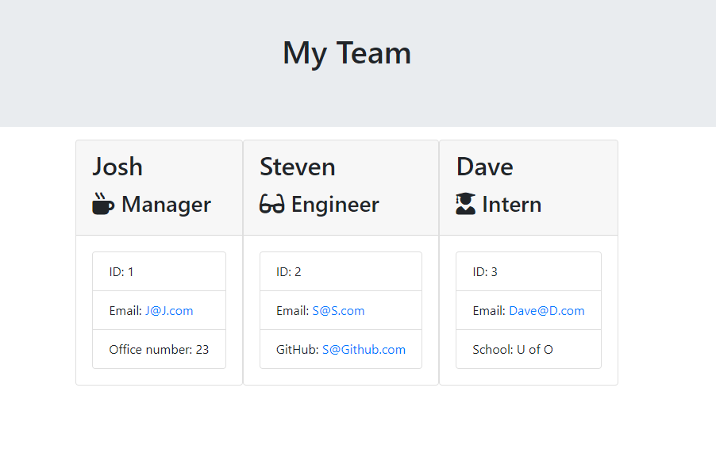

# Team Generator

This application will prompt the user for information about the team manager and then information about the team members. The user can input any number of team members, and they may be a mix of engineers and interns. When the user has completed building the team, the application will create an HTML file that displays a nicely formatted team roster based on the information provided by the user. 

The dependencies are, [jest](https://jestjs.io/) for running the provided tests, and [inquirer](https://www.npmjs.com/package/inquirer) for collecting input from the user.

### HTML Templates

* Following templates used:

  * `main.html`

  * `engineer.html`
  
  * `intern.html`
  
  * `manager.html`

### Classes
  Classes: `Employee`, `Manager`, `Engineer`, `Intern`. 
  The tests for these classes in the `tests` directory all passed.

The first class is an `Employee` parent class with the following properties and
methods:

  * name
  * id
  * email
  * getName()
  * getId()
  * getEmail()
  * getRole() // Returns 'Employee'

The other three classes will extend `Employee`. 

In addition to `Employee`'s properties and methods, `Manager` will also have:

  * officeNumber

  * getRole() // Overridden to return 'Manager'

In addition to `Employee`'s properties and methods, `Engineer` will also have:

  * github  // GitHub username

  * getGithub()

  * getRole() // Overridden to return 'Engineer'

In addition to `Employee`'s properties and methods, `Intern` will also have:

  * school 

  * getSchool()

  * getRole() // Overridden to return 'Intern'

### User input

Prompts the user to build an engineering team. An engineering
team consists of a manager, and any number of engineers and interns.

### Roster output

Generates a `team.html` page in the `output` directory, that displays a nicely formatted team roster. Each team member displays the following in no particular order:

  * Name

  * Role

  * ID

  * Role-specific property (School, link to GitHub profile, or office number)

## Example:
Video Walk-through: https://drive.google.com/file/d/16oEZFKE1PAABB_wEaDAOJuuRV_CxpzoG/view

